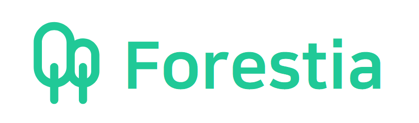

# Forestia-Back

**Next.js** 학습을 목적으로 제작하게 된 게시판 사이트 **Forestia**의 백엔드 단입니다.  
프로젝트에 대한 자세한 설명은 <a href="https://github.com/uncyclocity/Forestia">프론트엔드단 레포</a>를 참고해주시기 바랍니다.

</img>

## 💻 사용 기술

     

## 📜 간략한 설명

- 간단한 게시판 사이트의 백엔드 단입니다.
- 게시글 및 댓글의 작성/수정/삭제 및 이미지 업로드/삭제, 그리고 회원 관련 기능이 구현되어 있습니다.
- **MongoDB Atlas**를 DB로 사용하였습니다.
- 게시글에 첨부되는 이미지의 저장소로 **Amazon S3**를 사용하였습니다.
- 이전의 Heroku 서버에서 강원도 춘천 리젼의 **Oracle Cloud**로 이전하였습니다. Heroku보다 빠른 속도를 경험하실 수 있습니다.

## 🕓 향후 계획

- RESTful API 지향적으로 API 리팩토링
- 그 외에도 꾸준히 개선 사항을 모색중입니다🤔
